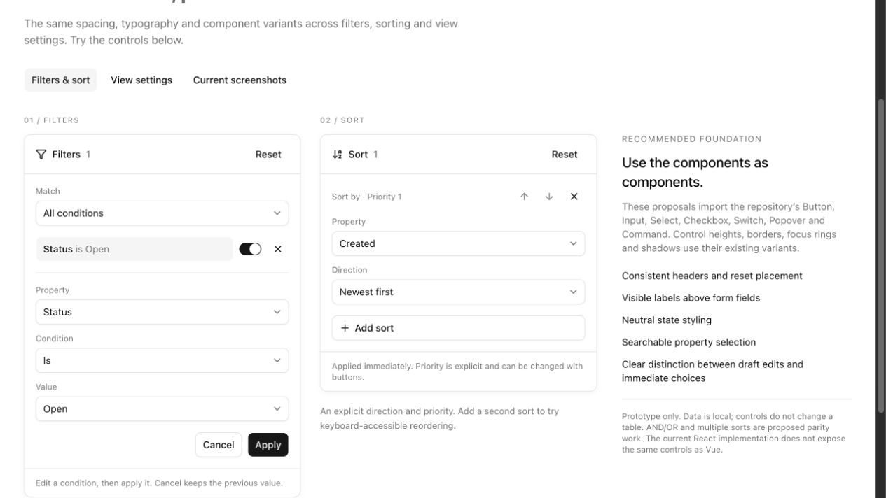
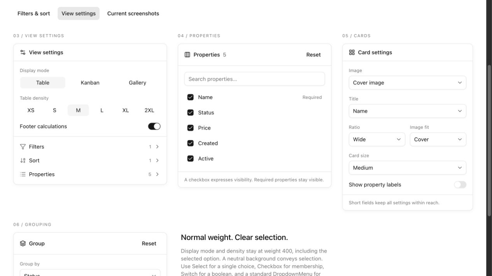

# Submenu UI audit and proposals

Reviewed on 2026-09-14 against `main` at `859c942`.

This is an internal design review, browser evidence, and an isolated interactive proposal. It does not change the shipped table, public configuration, registry, or public examples. The user requested an audit and visual proposals, and explicitly rejected extra font weight on density and display-mode choices.

## Review the proposals

```sh
bunx vite --config docs/ui-audit/preview/vite.config.mjs
```

Open <http://127.0.0.1:5176/> for six proposed screens and a gallery of current screenshots. Open <http://127.0.0.1:5176/?current=1> for the existing React toolbar and an internal fixture exposing the existing advanced filter types. The second fixture has static data: it exercises the editors, not server filtering.

- **Filters & sort:** edit/apply/cancel a condition, enable/disable it, search properties, add/remove sorts, and change their priority.
- **View settings:** normal-weight display/density choices, property visibility/search, compact card settings, and grouping.
- **Current screenshots:** captured React/Vue evidence, with links to full images.
- **Dark preview:** tests local tokens and portaled controls.

The proposal uses the repository's actual `Button`, `Input`, `Select`, `Checkbox`, `Switch`, `Popover`, and `Command` components. The surrounding boards are illustrations of panels, not production popup navigation. Form control variants are preserved. Explicit `font-normal` on display/density options implements the user's requested visual direction without changing the global Button style.

The prototype stores local state only. It does not apply filtering/sorting to table records. AND/OR, multiple sorts, and grouping order/empty-group choices are proposed product work and must be reconciled with both framework contracts before implementation. The main settings navigation rows are static illustrations. The board reflows on narrow screens; it does not implement the production mobile drawer.





## Findings and proposed fixes

### P1 — Replace the custom column action menu with DropdownMenu

**Confirmed interaction defect.** In the React example, open the Name column menu. Focus remains on the trigger; pressing Escape leaves the popup open. Focusing “Sort Ascending” and pressing ArrowDown leaves focus on that item. Rendered items have `role="menuitem"`, but there is no parent `role="menu"`.

The implementation in [`column-menu.tsx`](../../src/components/ui/yayaw-table/components/columns/header/column-menu.tsx) uses `useFloating`, `createPortal`, focusable `div` items, and only Enter/Space handlers. Disabled items retain `tabIndex=0` without an `aria-disabled` state. Every React column trigger is named “Toggle columns”, losing the column context. Vue's trigger includes the column name and its action menu uses menu primitives.

**Fix:** compose the existing Shadcn `DropdownMenu`, `DropdownMenuItem`, and checkbox/radio items, preserve all permissions and actions, and give each trigger a column-specific accessible name. Let the primitive manage Escape, arrow navigation, dismissal, focus return, and disabled items. Keep the existing Filter action opening the settings form.

**Acceptance:** keyboard-only open, move, activate, Escape, and focus return in both frameworks; disabled actions must not activate. This is an interaction fix, not only a styling change.

Evidence: [React column menu](screenshots/react-column-menu.png), [Vue column menu](screenshots/vue-column-menu.png).

### P1 — Reconcile the sorting interaction contract across React and Vue

**Confirmed parity difference.** React offers a list of columns and cycles ascending → descending → removed, with direction represented by an icon. Clicking another column replaces the current sort. Vue offers multiple rules, a native column select, a direction button, and an “Add sort” action. Adding a second sort retained the first in Vue.

Sources: [`table-sort-menu.tsx`](../../src/components/ui/yayaw-table/components/toolbar/sections/table-sort-menu.tsx), especially the `setSorting([{ ... }])`/`setSorting([])` callbacks; [`TableToolbar.vue`](../../packages/yayaw-table-vue/src/components/toolbar/TableToolbar.vue), `addSort`, `updateSortColumn`, and the sort panel.

**Fix:** a shared visible contract: Property, Direction, Remove, Add sort. Make priority explicit (“Sort by / Then by”). If the product supports multiple sorts, retain them when editing one rule, exclude already-used columns, and support moving priority without requiring drag. Use an explicit direction control with type-appropriate labels (e.g. Newest first for dates).

**Acceptance:** the same ordered serialized sorting state and record order for the same interaction in React and Vue, including saved-view restore, changing a property, and removing a rule. Decide multi-sort as product behavior; do not silently expand the React contract as a cosmetic change.

Evidence: [React sort](screenshots/react-sort-active.png), [Vue multiple sorts](screenshots/vue-sort-multiple.png).

### P2 — Remove extra weight from density and display mode

**Confirmed in code and computed styles.** All nine React choices (Table/Kanban/Gallery and XS/S/M/L/XL/2XL) computed to `font-weight: 500`, whether selected or not. They inherit `font-medium` from Button. Vue explicitly sets `.yayaw-segmented button { font-weight: 500; }`.

Sources: [`table-density-menu.tsx`](../../src/components/ui/yayaw-table/components/toolbar/table-density-menu.tsx), [`table-display-mode-switcher.tsx`](../../src/components/ui/yayaw-table/components/toolbar/table-display-mode-switcher.tsx), [`button-styles.ts`](../../src/components/ui/button-styles.ts), [`styles.css`](../../packages/yayaw-table-vue/src/styles.css).

**Fix:** scope `font-normal` / weight 400 to these choices in both frameworks. Retain `aria-pressed`, hover/focus styling, and the neutral selected background. Do not change the global Button default. Keep section labels and option text normal; reserve stronger typography for actual panel headings. Apply this to Gantt's display option too.

**Acceptance:** selected and unselected options compute to 400 in both frameworks and themes. The proposal was measured at 400 for all nine choices.

Evidence: [Current weight](screenshots/react-density-weight.png), [proposed settings](screenshots/proposal-view-settings.png).

### P2 — Give filters, sort, and grouping one panel vocabulary

React filters, sorting, and grouping each define their own padding, headings, reset placement, row heights, and active styles. Filters show “Clear filters” above the editor; sort/group put a smaller “Reset” beside a section title. Filter rows have an extra action menu and removal icon, inline edit state, and Cancel/Done actions. Vue's filter panel exposes Property/Operator/Value and “Match all/any”; its sort/group panels use yet another compact row treatment.

Sources: [`advanced-filter-panel.tsx`](../../src/components/ui/yayaw-table/components/filters/advanced-filter-panel.tsx), [`table-filters-menu.tsx`](../../src/components/ui/yayaw-table/components/toolbar/sections/table-filters-menu.tsx), [`group-picker.tsx`](../../src/components/ui/yayaw-table/components/toolbar/sections/group-picker.tsx), [`AdvancedFilters.vue`](../../packages/yayaw-table-vue/src/components/filters/AdvancedFilters.vue).

**Fix:** one panel header, one reset position, consistent 14px body text, normal option weight, shared spacing, and explicit labels. Reuse the same property picker for filters and sorting, with search for long column lists. Keep a compact condition summary and an editor using ordinary Input/Select/Checkbox/Calendar components. Reduce decorative cards and repeated separators. Show reset as disabled or absent for an empty state according to one consistent rule.

Editing a filter requires a draft (incomplete numbers/ranges must not change results). Explicit sort direction and visibility choices can remain immediate. Visual consistency does not require forcing unrelated commit semantics to match. The prototype labels the distinction.

**Acceptance:** identical draft/apply/cancel behavior and operator/value availability in both frameworks; clearly expose AND/OR only once the shared contract is reconciled. Preserve permissions, disabled choices, typed option identities, errors, and clear-all semantics.

Evidence: [text](screenshots/react-filter-text.png), [number](screenshots/react-filter-number.png), [operators](screenshots/react-filter-operators.png), [select](screenshots/react-filter-select.png), [boolean](screenshots/react-filter-boolean.png), [multiple values](screenshots/react-filter-multi.png), [filter actions](screenshots/react-filter-actions.png), [Vue editor](screenshots/vue-filter-editor.png).

### P2 — Replace remaining native controls and shorten card settings

React's gallery settings show full column lists for Image, Title, and Properties, followed by full option lists for ratio, fit, and size. Even with four data columns, later settings are below the fold. Vue's gallery already uses compact Reka-based `TableSelect` and `CardPropertiesMenu`, while its sort, group, advanced filter, and property visibility screens still include native `select`/`input[type=checkbox]` elements. Vue's properties show browser-blue checkboxes rather than the neutral component styling used elsewhere.

Sources: [`table-gallery-menu.tsx`](../../src/components/ui/yayaw-table/components/toolbar/table-gallery-menu.tsx), [`table-kanban-grouping-menu.tsx`](../../src/components/ui/yayaw-table/components/toolbar/table-kanban-grouping-menu.tsx), [`GallerySettings.vue`](../../packages/yayaw-table-vue/src/components/toolbar/GallerySettings.vue), [`TableToolbar.vue`](../../packages/yayaw-table-vue/src/components/toolbar/TableToolbar.vue), and [`controls`](../../packages/yayaw-table-vue/src/components/controls).

**Fix:** compact labeled selects for Image/Title/Ratio/Fit/Size; a searchable checkbox list for visible properties; a Switch for “Show property labels”. Reuse Vue's existing control layer and React's Shadcn components. Preserve mandatory/locked columns and provide an accessible reorder mechanism where ordering is supported. Avoid styling native controls to imitate a different component on each screen.

Evidence: [React gallery top](screenshots/react-gallery-settings.png), [React gallery bottom](screenshots/react-gallery-settings-bottom.png), [Vue gallery](screenshots/vue-gallery-settings.png), [React properties](screenshots/react-properties.png), [Vue properties](screenshots/vue-properties.png), [React Kanban](screenshots/react-kanban-settings.png), [Vue Kanban](screenshots/vue-kanban-settings.png).

### P2 — Use one locale for every calendar label

The React date filter shows French abbreviated months (“sept.”) alongside English weekday labels (“Su”, “Mo”, etc.) in the local example. The Calendar month formatter uses `date.toLocaleString(locale?.code, ...)`, which falls back to the browser's locale, while the calendar's other labels use the date-picker default. DateFilter does not pass a resolved date-fns locale to the Calendar instances.

**Fix:** resolve the table locale once and pass it consistently to month/year labels, weekdays, navigation names, and date formatting. Preserve date-only/timezone behavior. Bring Vue's native date input and React's calendar to an equivalent documented interaction contract.

Evidence: [date filter](screenshots/react-filter-date.png). Sources: [`calendar.tsx`](../../src/components/ui/calendar.tsx), [`date-filter.tsx`](../../src/components/ui/yayaw-table/components/filters/date-filter.tsx).

### P2 — Simplify mobile filter composition

At 390 × 844, both frameworks expose a working settings drawer. The React filter screen places quick filters before the advanced editor; Vue appends quick filters below the advanced form, followed by Add filter. This duplicates paths to related concepts and increases scrolling. The empty/draft structure and action placement differ substantially.

**Fix:** reuse the same logical screen order on desktop and mobile, keep a visible header, use a single scrolling body, and place apply/cancel where the keyboard cannot hide them. Keep existing touch target sizes. Validate nested Select/Popover behavior inside the drawer and focus restoration at each return.

Evidence: [React mobile filter](screenshots/react-mobile-filter.png), [Vue mobile filter](screenshots/vue-mobile-filter.png), [React mobile sort](screenshots/react-mobile-sort.png), [Vue mobile sort](screenshots/vue-mobile-sort.png).

## Screen inventory and coverage

“Opened” means browser interaction/DOM inspection; files in `screenshots/` preserve the captured states. This is coverage of the runnable local examples and shared menu components, not every application-specific configuration or backend failure.

| Surface | Review coverage | Recommendation |
| --- | --- | --- |
| Main view/settings menu | React + Vue desktop and mobile; display and density choices | Normal option weight; consistent headings, badges, arrows |
| Filter property list / empty state | React + Vue | Shared searchable picker and empty/reset treatment |
| Text filter | React + Vue editor | Shared field labels and draft actions |
| Number / range / operator list | React number/range and operator popup; Vue number editor | Preserve numeric drafts, align controls |
| Boolean / single choice | React + Vue editor | Standard Select or labeled choice group |
| Multi-select | React + Vue editor | Standard checkboxes; preserve typed values and disabled options |
| Date filter | React calendar, Vue date editor | Resolve locale consistently; align interaction |
| Filter secondary actions | React Edit/Disable/Remove menu | Keep DropdownMenu; avoid duplicated remove affordances |
| Quick filters | React Status, Vue Tags; mobile embedding | Same checkbox/search primitive and grouping |
| Sort | React empty/active; Vue one/multiple rules; both mobile | Explicit direction, shared multi-sort contract |
| Group | React empty/active with collapse/expand; Vue entry | Shared property picker and explicit ordering |
| Properties | React + Vue desktop; React mobile | Search, component checkbox, explain locked columns |
| Gallery card settings | React full scroll and Vue compact screen | Compact selects and shared property picker |
| Kanban card settings | React + Vue | Reuse the same card controls |
| Saved views | Both main lists and Save view dialogs | Preserve standard Dialog; align field/action wording |
| Column action menu | React + Vue; explicit React Escape/ArrowDown test | Replace custom React portal with DropdownMenu |
| Footer calculation menu | Both roots; React Count/Percent/More options submenus | Existing menu primitives are a useful reference |
| Row actions | React action menu | Keep the existing DropdownMenu pattern |
| Data actions / export | Both mobile menus; React desktop Export is a direct download | Do not invent a submenu for direct actions |
| Gantt | React runnable example and main settings; Zoom/week-start/dependency controls inspected | Include display typography; keep adapters aligned with the shared planning surface |

Not exercised: server error/retry injection, saved-view deletion or permission variants, every nested gallery property choice, Gantt planning mutations, bulk-edit forms, catalogue forms, and application-supplied menus. These require a separate functional matrix when implementing the fixes. No claim of complete accessibility certification is made.

## Component direction

The repository really does use Shadcn/Base UI components in React and Reka primitives in Vue. The inconsistency comes from the mix of custom panel markup, control overrides, native Vue controls, and different compositions. Base UI itself is not evidence of an incorrect Shadcn setup: Shadcn documents it as a supported component foundation.

- [Shadcn Base UI Popover](https://ui.shadcn.com/docs/components/base/popover): appropriate for a settings surface containing form controls.
- [Shadcn Base UI DropdownMenu](https://ui.shadcn.com/docs/components/base/dropdown-menu): appropriate for column/row actions and calculation submenus.
- [Shadcn Combobox composition](https://v3.shadcn.com/docs/components/combobox): Popover + Command is an established searchable-picker pattern and matches the available repository components.

Do not replace every settings form with a menu widget. Keep Popover/Dialog/Drawer semantics for forms and standard menu semantics for actions.

## Suggested implementation order

1. **Component consistency and accessibility:** normal-weight density/display controls; standard column action menu; shared spacing/reset rules; replace remaining native Vue controls. Ship equivalent React/Vue regression coverage.
2. **Filters/sort/group contract:** agree on ordered multi-sort and AND/OR exposure; implement both editions and the same serialized-state fixtures; add draft, cancel, reset, duplicate-column, keyboard and saved-view regression coverage.
3. **Card settings and mobile consolidation:** compact controls, visible-property search, shared mobile order, consistent date locale; exercise both runnable examples in light/dark themes and with long labels/many columns.

Every consumer-facing implementation needs an appropriate Changeset, `docs/FRAMEWORK-PARITY.md` updates, registry generation and `bun run release:check`. It also requires the companion bilingual Yayaw documentation PR and protected seed transition/deployment verification described in `AGENTS.md`. This audit does not change consumer behavior and therefore does not ship those migrations.

## Verification

- The full `bun run release:check` gate passed during this audit: 516 React tests, 403 Vue tests, type checking, Vue library build, registry generation, and Vue demo/registry pages build. Existing warnings about unused suppression comments and bundle size remain.
- The isolated prototype passes `bunx tsc -p docs/ui-audit/preview/tsconfig.json --noEmit` and `bun x ultracite check docs/ui-audit/preview`.
- `bunx vite build --config docs/ui-audit/preview/vite.config.mjs` builds the isolated proposal and current-UI harness. Large bundle warnings are expected because the harness imports the full table examples.
- Browser checks: property search, adding a second sort, moving its priority, cancel preserving a filter, apply changing its summary, light/dark popup opening, screenshot loading, and measured density/display option weight 400.
- React Doctor was used as a discovery aid. Its workspace score includes generated registry duplicates and findings outside this review; it is not treated as proof of any UI defect. The initial npm invocation failed on the existing lodash override, and the Bun invocation completed. Only findings checked against source or browser behavior are promoted above.
