# View settings corrections

The production React and Vue components now share the same settings flow for Gallery, Kanban and Gantt. This follows the earlier menu audit; filter and sort redesign proposals from that audit remain separate.

- Gallery and Kanban use labelled select controls instead of large custom option lists. Properties open a persistent checkbox screen.
- Gantt presentation settings move to View → Gantt settings. Timeline navigation stays near the timeline.
- On mobile, choices replace the current drawer screen and reuse its header, Back action and focus boundary. Planning editors become bottom sheets.
- The menu has one bounded scroll region. Short content does not create a scrollbar, and long content remains reachable.
- Density and display choices use normal font weight. Share matches Search and Export at 32px on desktop and has a 44px target in the mobile actions drawer.

## Visual examples

### Gallery

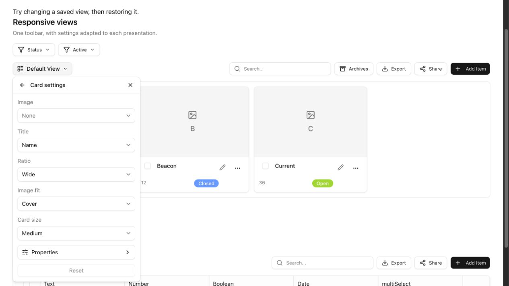

| React mobile | Vue mobile |
| --- | --- |
| 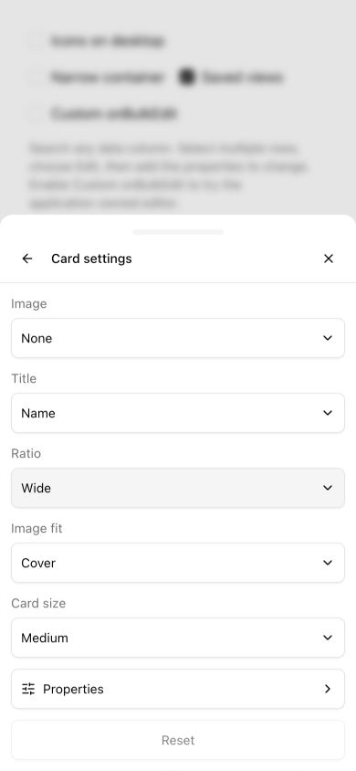 | 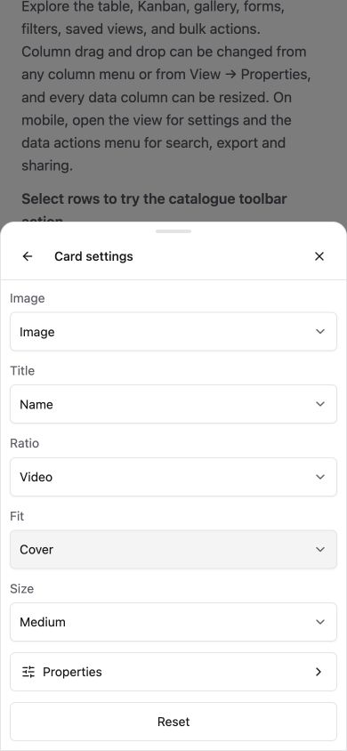 |
| 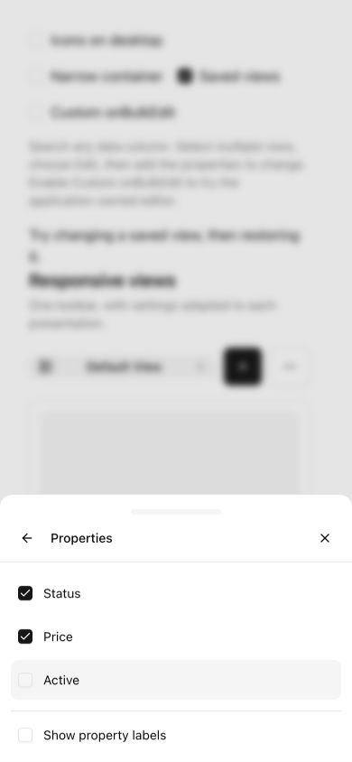 | 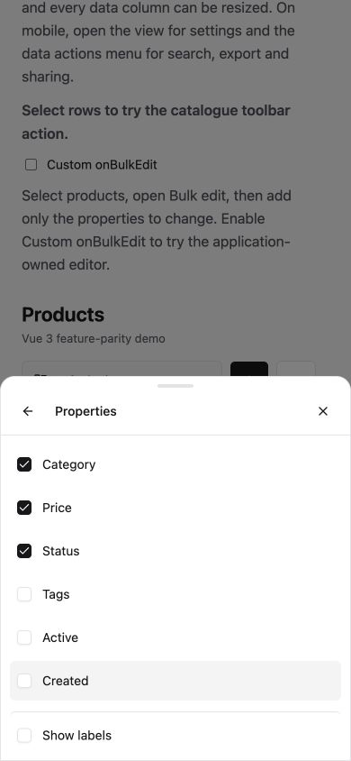 |

### Kanban

| React mobile | Vue mobile |
| --- | --- |
| 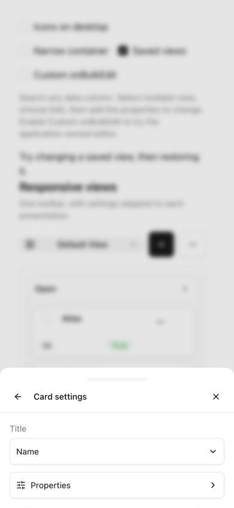 | 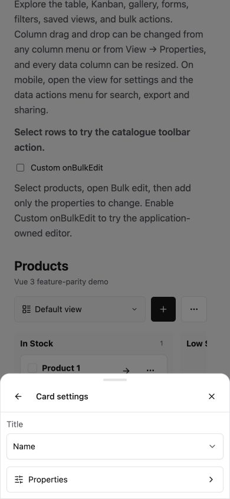 |

### Gantt

| React mobile | Vue mobile |
| --- | --- |
| 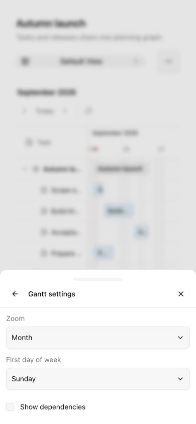 | 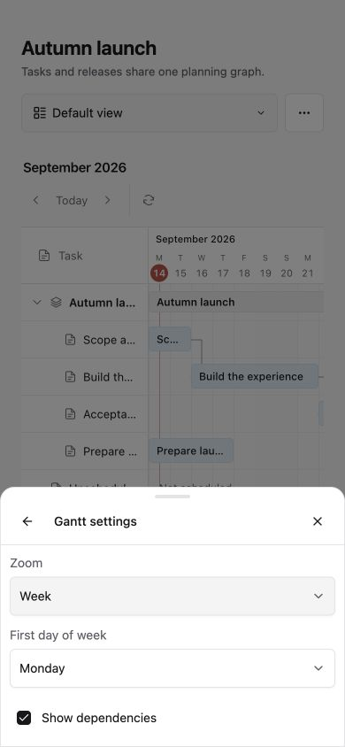 |
| 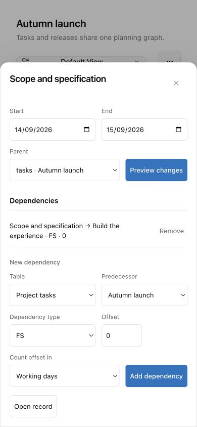 | 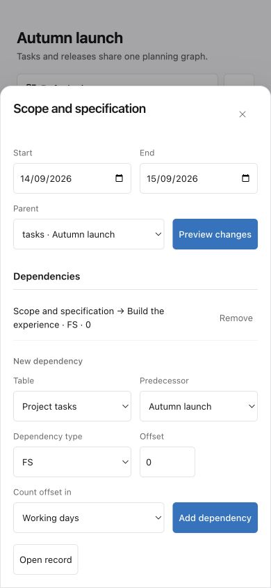 |

### Share

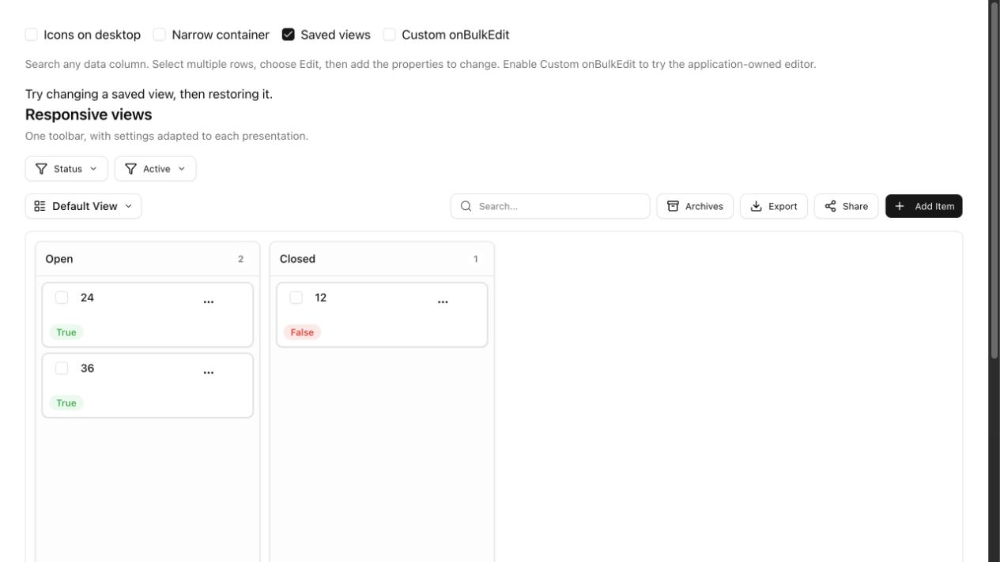

## Verification

`bun run release:check` passes: 521 React tests, 406 Vue tests, type checks, builds and registry generation. Existing unused-suppression and bundle-size warnings remain.

Real-browser checks cover all three modes on desktop and at 390 × 844, including field changes, repeated property selection, back navigation, persisted view settings and planning editors. Both Share buttons measure 32px on desktop and 44px inside the mobile actions drawer. The React Gallery desktop viewport measures 474px for both client and content height, with no overflow. At 390 × 568, its 399px viewport scrolls through 534px of content and the Properties screen remains reachable. Vue radio and checkbox indicators remain 16px inside 44px selectable rows.
